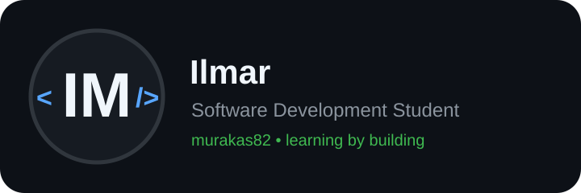

  

## About me

I'm currently studying software development and using GitHub to document what I build and learn along the way.

I'm still early in my developer journey, so this profile is not a list of technologies I've mastered. It is a record of what I'm currently learning and using in real projects.

- Studying software development
- Building personal and school projects
- Learning backend development, databases and web development
- Using AI tools such as ChatGPT and Codex to help me learn, understand code, debug problems and build projects
- Practising Git, GitHub and deployment workflows
- Learning mainly by building complete projects instead of only doing isolated exercises

## Currently learning & using

  

`C# / .NET` · `PHP / Laravel` · `SQL / MySQL` · `Git / GitHub` · `AI-assisted development`

---

## How I use AI

AI is part of my learning and development workflow.

I use tools such as **ChatGPT and Codex** to:

- understand unfamiliar code and concepts
- debug problems
- learn new frameworks and tools
- review and improve my code
- help turn ideas into working projects

I try to understand the code I build rather than just generate it.

---

## GitHub activity

I'm using GitHub mainly to document my progress and keep my learning projects in one place.

My current focus is:

**Backend development · Databases · C#/.NET · Laravel/PHP · AI-assisted development**
